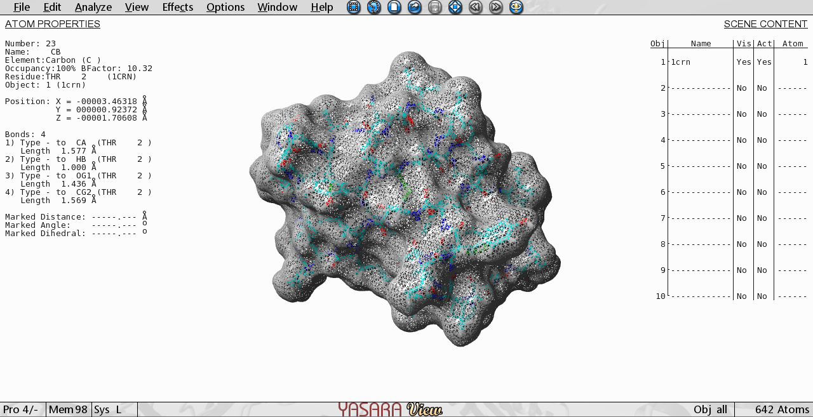

# Визуализация структуры белка
Использованное ПО: YASARA

Выбранная структура белка: [1CAG](https://www.rcsb.org/structure/1CAG)

# Визуализация различными способами
По гайдам названия немного отличаются:

## Wireframe
View->Show Atoms->All
View->Style Atoms-> Stick

## Backbone
View->Show Atoms->All
View->Show trace

## Spacefill
View-> Style atoms -> Balls

## Ribbons
View-> Style scene ->Ribbons

## Molecular surface
View->Show surface -> (optional. configure the params of surface)

# Раскраска структур
## Цветовой моделью CPK
View->Color->By Element (default after loading)

## Различными цветами по доменам (частям) белка
View->Color->Chosing the chain->chosing the color of the chain-> OK->repeat

# Изображение публикационного качества

